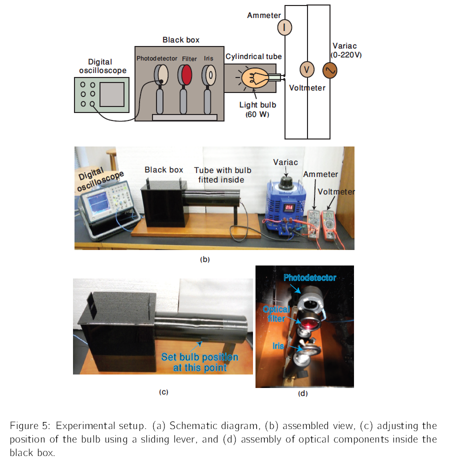

## Experimental Setup

## Procedure

The experimental setup is shown in Figure (5). Complete the assembly as sketched in figure (5a). Connect a 60W incandescent light bulb to the variac through an ammeter (digital mulimetrer) in series. A digital voltmeter is also connected in parallel to measure voltage values. The variac is an AC transformer that gives variable voltages.

**Note: Make sure the variac is unplugged when you are making electrical connections. Wear safety gloves. Remember, never touch bare electric wires.**

You are provided with a cylindrical tube with bulb fitted inside it. Inert this cylindrical tube into the black box. Fix the bulb position as shown in Figure (5c). Now assemble the optical components in a way shown in Figure (5d) and connect the silicon photodiode to digital oscilloscope.

## Observation Table

| V (V) | &Delta;V (V) | I (mA) | &Delta;I (mA) | R (&Omega;) | &Delta;R (&Omega;) | P (W) | &Delta;P (W) | T (K) | &Delta;T (K) | Irad (mV) | &Delta;Irad (1%) (mV) |
| :---: | :----------: | :----: | :-----------: | :---------: | :----------------: | :---: | :----------: | :---: | :----------: | :-------: | :-------------------: |
|  34   |     0.4      |  100   |       1       |     329     |         6          | 3.31  |     0.09     |  976  |      12      |    0.4    |     1% of I value     |
|  57   |              |        |               |             |                    |       |              |       |              |           |                       |
|   .   |              |        |               |             |                    |       |              |       |              |           |                       |
|   .   |              |        |               |             |                    |       |              |       |              |           |                       |
|  210  |              |        |               |             |                    |       |              |       |              |           |                       |

Table 2: Model table for experimental results.
