## Apparatus

1. A commercially available tungsten filament incandescent light bulb rated at 60 W, 220-240 V.
2. Variac (0-220 V),
3. Connecting wires,
4. Digital multimeters to measure current I and voltage V ,
5. Bandpassfilter of red wavelength (650 nm, Thorlabs FB 650-10),
6. Silicon photo-detector (Newport 818-SL),
7. Aperture to modulate power density incident on detector,
8. Digital oscilloscope (BK Precision 2534),
9. Enclosing black box and cylindrical tube (inner diameter= 87:42 mm, outer diameter= 89:39 and length= 41 cm), homemade,
10. Optical rail, homemade.

## Theory

### Thermal or blackbody radiation

We see objects when light is reflected from them. At high temperatures, bodies become self luminous and start glowing even in the dark. Radiation emitted by a body due to its temperature is called thermal radiation. All bodies not only emit but also absorb such radiations from their surroundings and finally come into thermal equilibrium. If we steadily increase the temperature we notice that the predominant color shifts from dull red through bright yellow-orange to bluish white heat. This change in color shows that the frequency distribution of the emitted radiation changes with temperature. Since the thermal radiation spectrum strongly depends on temperature, we can easily estimate the temperature of a hot body through the emitted radiation. This is the basis of color thermometry [1].

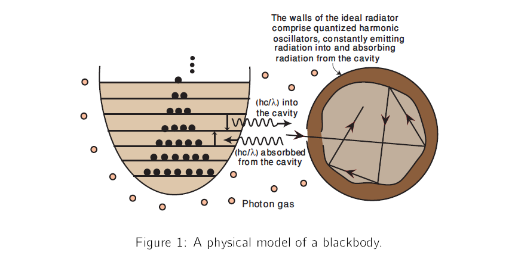

In real practice, the radiation emitted by a body not only depends on the temperature but also depends on the material, shape and nature of its surface. Such factors make it difficult to understand thermal radiation in terms of simple physical models, just like difficulties arise in understanding properties of real gases in term of simple atomic model. The 'gas problem' was resolved by introducing an 'ideal gas'. Likewise the radiation problem is solved by introducing the concept of an 'ideal radiator' for which the spectral distribution depends only on the temperature and on nothing else.

An ideal radiator can be made by forming a cavity within a body, the walls being held at uniform temperature. A small hole is also pierced inside the cavity to examine the nature of the radiations inside the cavity. This ideal radiator is a called black-body, it is a perfect emitter and perfect absorber of all the electromagnetic radiation that falls on it [1, 2, 3]. A physical model is shown in Figure (1).

Some properties of the cavity radiation are given below,

**Stefan-Boltzmann law** The total emitted power per unit area, over all wavelengths is called radiant intensity I(T) and is given by,

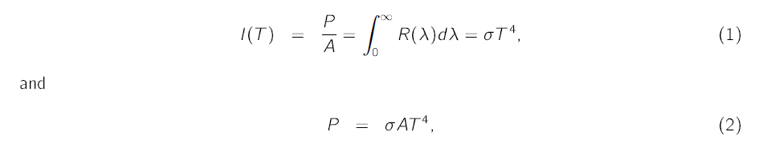

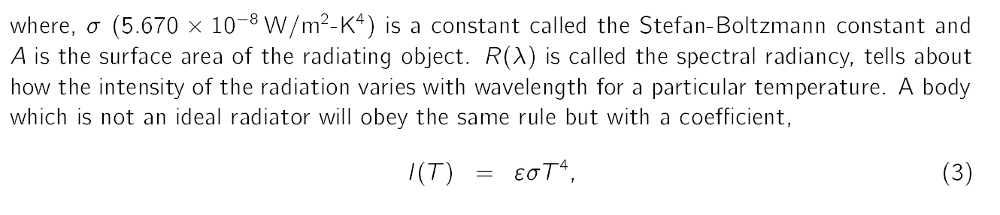

where &epsilon; is a dimensionless quantity, called the emissivity of the material. For a black body, &epsilon; = 1, but for all other objects the emissivity is always less than one.

**Wein's displacement law** WilhelmWein (1864-1928) deduced that &lambda;max at which the spectral radiancy is maximum varies as 1=T and the product is a universal constant,

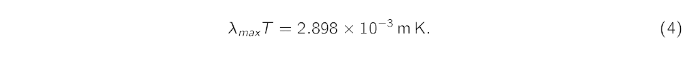

The spectrum of intensity as a function of wavelength for cavity radiation for selected temperatures is sown in Figure (2). The diagram indicates a wavelength shift of the most intense radiation (indicated by the peak) towards lower wavelength as the temperature of the black body increases.

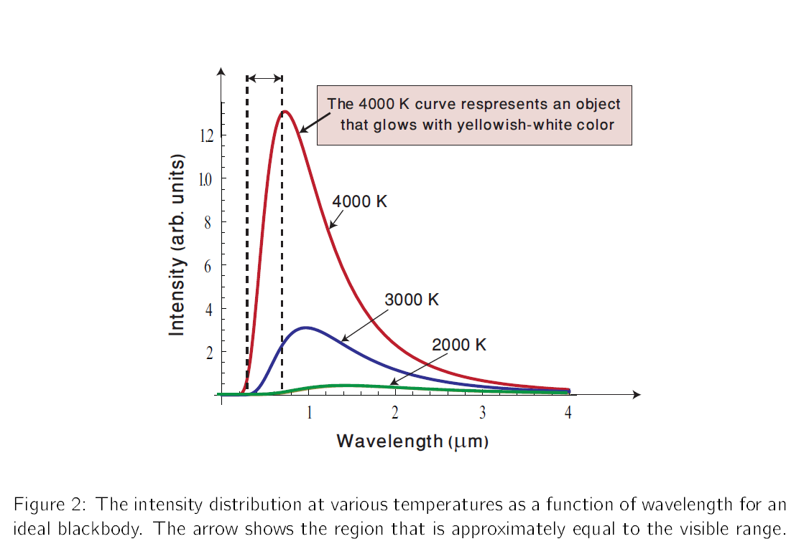

**Planck's radiation law**

Around the year 1900, attempts were made to find a simple formula that can fit the experimental curves similar to the ones shown in Figure (2). For example, Rayleigh and Jeans derived a relationship based on classical physics and his formula fit the curves in the limit of very long wavelengths (low frequencies) much larger than 50 &mu;m. Wein's theoretical expression, though a 'guess' fit the experimental curves at short wavelengths but departed at longer wavelengths. A comparison is displayed in Figure (3).

Max Planck tried to reconcile the two radiation laws. He made an interpolation that remarkably fit the experimental data at all wavelengths. Planck's formula related the intensity of the emitted radiation at a particular wavelength &lambda; to the temperature T by,

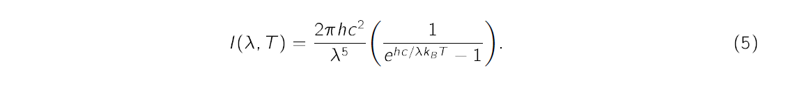

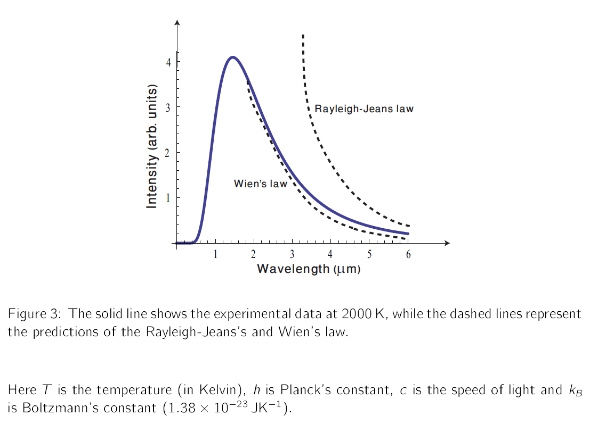

Planck's radiation law (5) can be used to find the intensity ratio being measured at the same wavelength &lambda; but at two different temperatures T1 and T2 [4],

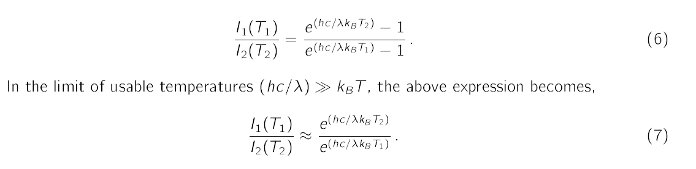

Thus, Equation (7) holds good for the visible range and typical filament temperatures (upto 2500 K) in incandescent light bulbs. Planck's constant can be determined for any pair of measured intensities and their respective temperatures.

**Primer on light bulbs and their temperature**

Incandescent light bulbs are supposed to be the hottest things in our homes. Some typical temperatures in a common household are given below,

|  Object Name  | Temperature (K) |
| :-----------: | :-------------: |
| Cooking oven  |       600       |
| Candle flame  |      1700       |
| Sui gas flame |      2300       |

Table 1: Approximate steady state temperatures of some household items.

A tungsten light bulb is shown in Figure (4).

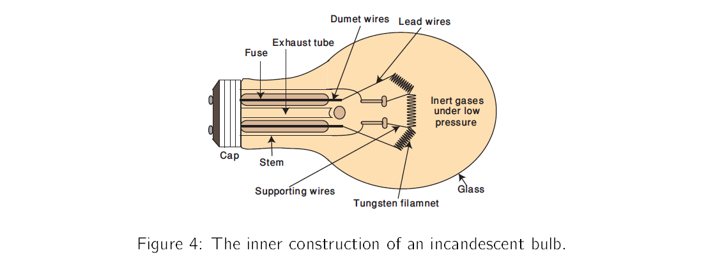

The measurement of the temperature of the filament without making direct contact with bulb is somewhat tricky task [6, 7, 8, 9]. We will use the following technique to get reasonably accurate results.

For an ideal blackbody, the emitted power can be found out using Stefan-Boltzmann law,

Suppose we supply electrical energy to the incandescent bulb. The electric power that goes into the bulb is

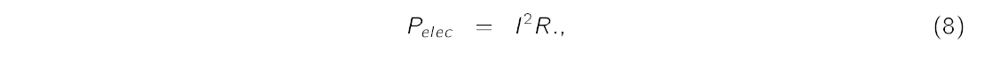
where I is the current and R is the resistance. Assume that the total electrical power going into the filament is entirely emitted by radiative processes, i.e.

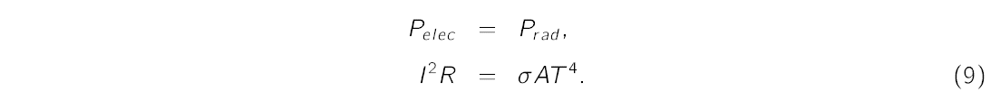

For temperatures ranging from room to about 2500 K, a tungsten filament supposedly obeys a linear relation between its resistance and temperature,

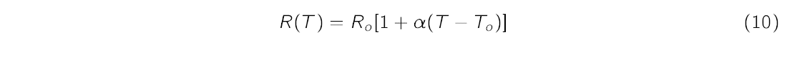
where Ro represents ambient resistance measured at ambient temperature To and &alpha; is temperature coefficient of resistivity. However, &alpha; may itself depend on temperature. (Relying on published temperature coefficients for commercial tungsten may also be problematic since the filament contain unknown amounts of impurities). Instead we assume a non-linear relation between R and T given by the power law,

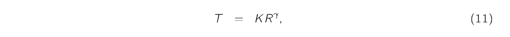
where K is an unknown constant. Under this assumption, Equation (9) becomes,

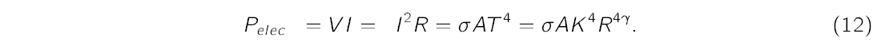

Later in the experiment we will use this equation to determine the value of &gamma; for our light bulb. This value of &gamma; will later be used to estimate the temperature of the filament using the following equation,

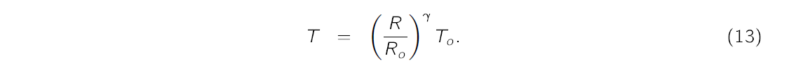
Here Ro is the resistance of the unenergized bulb at temperature To.
